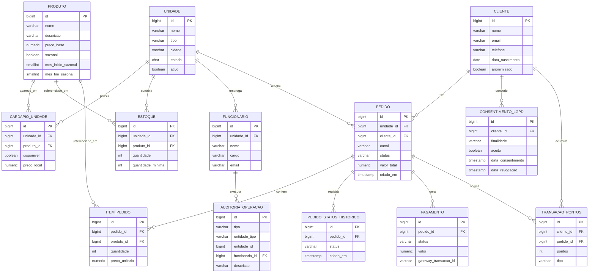

# DER — Diagrama Entidade-Relacionamento

```mermaid
erDiagram
    UNIDADE ||--o{ CARDAPIO_UNIDADE : possui
    PRODUTO ||--o{ CARDAPIO_UNIDADE : aparece_em
    UNIDADE ||--o{ ESTOQUE : controla
    PRODUTO ||--o{ ESTOQUE : referenciado_em
    UNIDADE ||--o{ FUNCIONARIO : emprega
    UNIDADE ||--o{ PEDIDO : recebe
    CLIENTE ||--o{ PEDIDO : faz
    PEDIDO ||--o{ ITEM_PEDIDO : contem
    PRODUTO ||--o{ ITEM_PEDIDO : referenciado_em
    PEDIDO ||--o{ PEDIDO_STATUS_HISTORICO : registra
    PEDIDO ||--o{ PAGAMENTO : gera
    CLIENTE ||--o{ CONSENTIMENTO_LGPD : concede
    CLIENTE ||--o{ TRANSACAO_PONTOS : acumula
    PEDIDO ||--o{ TRANSACAO_PONTOS : origina
    FUNCIONARIO ||--o{ AUDITORIA_OPERACAO : executa

    UNIDADE {
        bigint id PK
        varchar nome
        varchar tipo
        varchar cidade
        char estado
        boolean ativo
    }
    PRODUTO {
        bigint id PK
        varchar nome
        varchar descricao
        numeric preco_base
        boolean sazonal
        smallint mes_inicio_sazonal
        smallint mes_fim_sazonal
    }
    CARDAPIO_UNIDADE {
        bigint id PK
        bigint unidade_id FK
        bigint produto_id FK
        boolean disponivel
        numeric preco_local
    }
    ESTOQUE {
        bigint id PK
        bigint unidade_id FK
        bigint produto_id FK
        int quantidade
        int quantidade_minima
    }
    FUNCIONARIO {
        bigint id PK
        bigint unidade_id FK
        varchar nome
        varchar cargo
        varchar email
    }
    CLIENTE {
        bigint id PK
        varchar nome
        varchar email
        varchar telefone
        date data_nascimento
        boolean anonimizado
    }
    CONSENTIMENTO_LGPD {
        bigint id PK
        bigint cliente_id FK
        varchar finalidade
        boolean aceito
        timestamp data_consentimento
        timestamp data_revogacao
    }
    PEDIDO {
        bigint id PK
        bigint unidade_id FK
        bigint cliente_id FK
        varchar canal
        varchar status
        numeric valor_total
        timestamp criado_em
    }
    ITEM_PEDIDO {
        bigint id PK
        bigint pedido_id FK
        bigint produto_id FK
        int quantidade
        numeric preco_unitario
    }
    PEDIDO_STATUS_HISTORICO {
        bigint id PK
        bigint pedido_id FK
        varchar status
        timestamp criado_em
    }
    PAGAMENTO {
        bigint id PK
        bigint pedido_id FK
        varchar status
        numeric valor
        varchar gateway_transacao_id
    }
    TRANSACAO_PONTOS {
        bigint id PK
        bigint cliente_id FK
        bigint pedido_id FK
        int pontos
        varchar tipo
    }
    AUDITORIA_OPERACAO {
        bigint id PK
        varchar tipo
        varchar entidade_tipo
        bigint entidade_id
        bigint funcionario_id FK
        varchar descricao
    }
```

Script executável completo: `src/main/resources/db/migration/V1__init.sql`.
